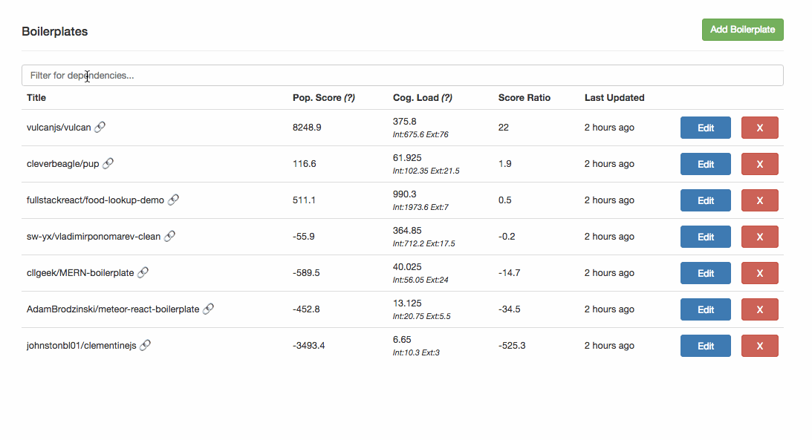

### This is Jason.

### Jason is a mailman but he likes to compete in hackathons and make side projects in his spare time.

### However he wastes a lot of time evaluating boilerplates and starter kits arbitrarily.

### This makes Jason a sad mailman.

### Help Jason rate boilerplates.

# Introducing PackageJason
A hackathon/starter kit/boilerplate rating engine. 

- SEARCH: Search open source boilerplates by desired stack (we crawl the dependencies/devDeps for you)
- FAVE: Keep a list of your favorites you can come back to and use
- SCORE: Rapidly evaluate the "cognitive load" of any boilerplate you come across!

### With his new boilerplate skills, Jason even has time to ask Package Jane out on a date!

### Will she accept? Stay tuned!

---

# Contributors

[Public trello board here.](https://trello.com/b/u28EAYJ5/swyx-boilerpl8). Chat with maintainer on twitter [@swyx](http://twitter.com/swyx).

# FAQ

**So how do I use this thing?**

You can't. Package Jason is still working on it. This isn't launched yet. However we appreciate your interest. 

Obligatory Government Notice: Whether you are sending it or receiving it, your mail is important to you and the US Postal Service®. When mail is lost or delayed, we want to find it. 

If you think your package or mail is lost or delayed, follow these steps to help us find your mail.

**Before You Begin**

**Check Current Status**

Before you begin your search, if your package or mailpiece has tracking, check USPS Tracking® to see its current status.
USPS Tracking

**Informed Delivery® Users**

Informed Delivery provides a digital preview of your incoming mail. There may be occasions where a mailpiece may be delayed in reaching its destination. For additional information, please visit Informed Delivery FAQs.

**Submit a Search Request**

If after 7 business days, your mail or package hasn’t arrived, submit a Missing Mail Search Request with the following information:

- Sender mailing address
- Recipient mailing address
- Size and type of container or envelope you used
- Identifying information such as your USPS Tracking number(s), the mailing date from your mailing receipt, or Click-N-Ship® label receipt
- Description of the contents such as what it is and the brand, model, color, or size, if applicable
- Pictures that could help us recognize your item

**So is "Package" a title or a job description or a last name or...?**

Yes

---

[Base boilerplate taken from cleverbeagle/pup](http://cleverbeagle.com/pup)
